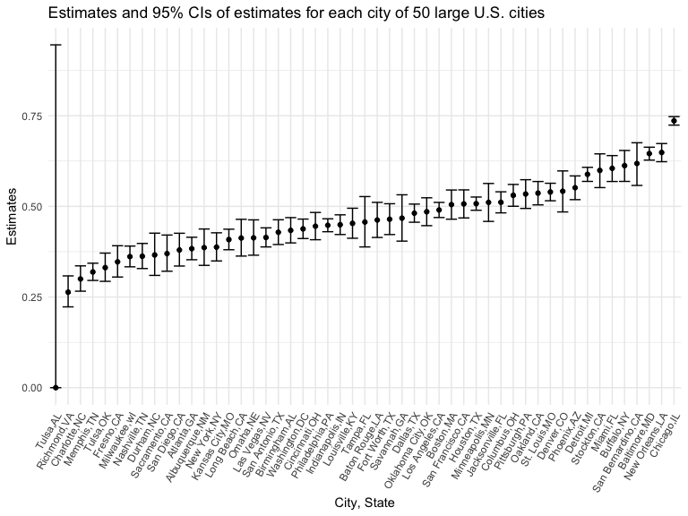
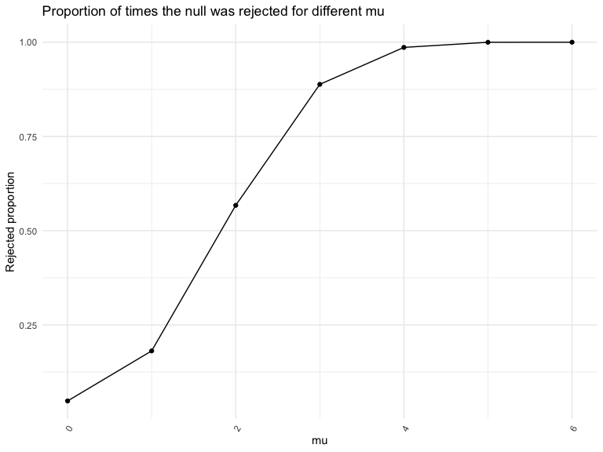
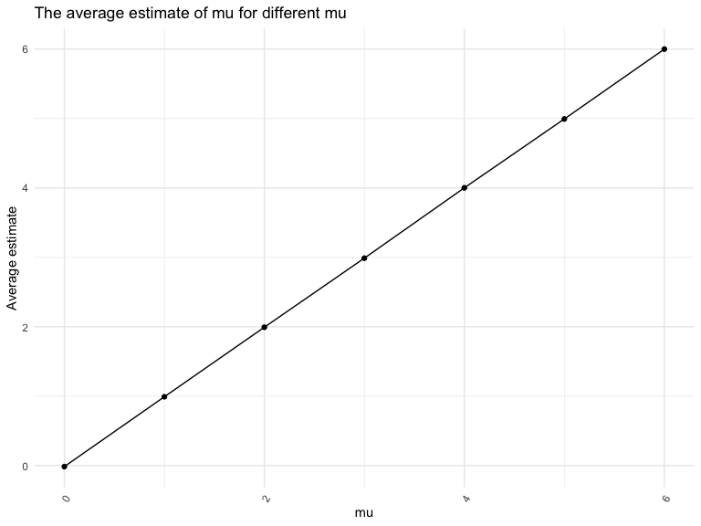
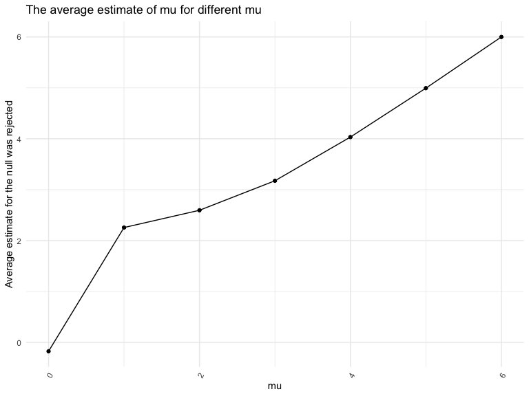

p8105_hw5_yz4436
================
Yuanhao Zhang
2022-11-16

## Problem 1

The code chunk below imports the data in individual spreadsheets
contained in `./data/zip_data/`. To do this, I create a dataframe that
includes the list of all files in that directory and the complete path
to each file. As a next step, I `map` over paths and import data using
the `read_csv` function. Finally, I `unnest` the result of `map`.

``` r
full_df = 
  tibble(
    files = list.files("data/zip_data/"),
    path = str_c("data/zip_data/", files)
  ) %>% 
  mutate(data = map(path, read_csv)) %>% 
  unnest()
```

    ## Rows: 1 Columns: 8
    ## ── Column specification ────────────────────────────────────────────────────────
    ## Delimiter: ","
    ## dbl (8): week_1, week_2, week_3, week_4, week_5, week_6, week_7, week_8
    ## 
    ## ℹ Use `spec()` to retrieve the full column specification for this data.
    ## ℹ Specify the column types or set `show_col_types = FALSE` to quiet this message.
    ## Rows: 1 Columns: 8
    ## ── Column specification ────────────────────────────────────────────────────────
    ## Delimiter: ","
    ## dbl (8): week_1, week_2, week_3, week_4, week_5, week_6, week_7, week_8
    ## 
    ## ℹ Use `spec()` to retrieve the full column specification for this data.
    ## ℹ Specify the column types or set `show_col_types = FALSE` to quiet this message.
    ## Rows: 1 Columns: 8
    ## ── Column specification ────────────────────────────────────────────────────────
    ## Delimiter: ","
    ## dbl (8): week_1, week_2, week_3, week_4, week_5, week_6, week_7, week_8
    ## 
    ## ℹ Use `spec()` to retrieve the full column specification for this data.
    ## ℹ Specify the column types or set `show_col_types = FALSE` to quiet this message.
    ## Rows: 1 Columns: 8
    ## ── Column specification ────────────────────────────────────────────────────────
    ## Delimiter: ","
    ## dbl (8): week_1, week_2, week_3, week_4, week_5, week_6, week_7, week_8
    ## 
    ## ℹ Use `spec()` to retrieve the full column specification for this data.
    ## ℹ Specify the column types or set `show_col_types = FALSE` to quiet this message.
    ## Rows: 1 Columns: 8
    ## ── Column specification ────────────────────────────────────────────────────────
    ## Delimiter: ","
    ## dbl (8): week_1, week_2, week_3, week_4, week_5, week_6, week_7, week_8
    ## 
    ## ℹ Use `spec()` to retrieve the full column specification for this data.
    ## ℹ Specify the column types or set `show_col_types = FALSE` to quiet this message.
    ## Rows: 1 Columns: 8
    ## ── Column specification ────────────────────────────────────────────────────────
    ## Delimiter: ","
    ## dbl (8): week_1, week_2, week_3, week_4, week_5, week_6, week_7, week_8
    ## 
    ## ℹ Use `spec()` to retrieve the full column specification for this data.
    ## ℹ Specify the column types or set `show_col_types = FALSE` to quiet this message.
    ## Rows: 1 Columns: 8
    ## ── Column specification ────────────────────────────────────────────────────────
    ## Delimiter: ","
    ## dbl (8): week_1, week_2, week_3, week_4, week_5, week_6, week_7, week_8
    ## 
    ## ℹ Use `spec()` to retrieve the full column specification for this data.
    ## ℹ Specify the column types or set `show_col_types = FALSE` to quiet this message.
    ## Rows: 1 Columns: 8
    ## ── Column specification ────────────────────────────────────────────────────────
    ## Delimiter: ","
    ## dbl (8): week_1, week_2, week_3, week_4, week_5, week_6, week_7, week_8
    ## 
    ## ℹ Use `spec()` to retrieve the full column specification for this data.
    ## ℹ Specify the column types or set `show_col_types = FALSE` to quiet this message.
    ## Rows: 1 Columns: 8
    ## ── Column specification ────────────────────────────────────────────────────────
    ## Delimiter: ","
    ## dbl (8): week_1, week_2, week_3, week_4, week_5, week_6, week_7, week_8
    ## 
    ## ℹ Use `spec()` to retrieve the full column specification for this data.
    ## ℹ Specify the column types or set `show_col_types = FALSE` to quiet this message.
    ## Rows: 1 Columns: 8
    ## ── Column specification ────────────────────────────────────────────────────────
    ## Delimiter: ","
    ## dbl (8): week_1, week_2, week_3, week_4, week_5, week_6, week_7, week_8
    ## 
    ## ℹ Use `spec()` to retrieve the full column specification for this data.
    ## ℹ Specify the column types or set `show_col_types = FALSE` to quiet this message.
    ## Rows: 1 Columns: 8
    ## ── Column specification ────────────────────────────────────────────────────────
    ## Delimiter: ","
    ## dbl (8): week_1, week_2, week_3, week_4, week_5, week_6, week_7, week_8
    ## 
    ## ℹ Use `spec()` to retrieve the full column specification for this data.
    ## ℹ Specify the column types or set `show_col_types = FALSE` to quiet this message.
    ## Rows: 1 Columns: 8
    ## ── Column specification ────────────────────────────────────────────────────────
    ## Delimiter: ","
    ## dbl (8): week_1, week_2, week_3, week_4, week_5, week_6, week_7, week_8
    ## 
    ## ℹ Use `spec()` to retrieve the full column specification for this data.
    ## ℹ Specify the column types or set `show_col_types = FALSE` to quiet this message.
    ## Rows: 1 Columns: 8
    ## ── Column specification ────────────────────────────────────────────────────────
    ## Delimiter: ","
    ## dbl (8): week_1, week_2, week_3, week_4, week_5, week_6, week_7, week_8
    ## 
    ## ℹ Use `spec()` to retrieve the full column specification for this data.
    ## ℹ Specify the column types or set `show_col_types = FALSE` to quiet this message.
    ## Rows: 1 Columns: 8
    ## ── Column specification ────────────────────────────────────────────────────────
    ## Delimiter: ","
    ## dbl (8): week_1, week_2, week_3, week_4, week_5, week_6, week_7, week_8
    ## 
    ## ℹ Use `spec()` to retrieve the full column specification for this data.
    ## ℹ Specify the column types or set `show_col_types = FALSE` to quiet this message.
    ## Rows: 1 Columns: 8
    ## ── Column specification ────────────────────────────────────────────────────────
    ## Delimiter: ","
    ## dbl (8): week_1, week_2, week_3, week_4, week_5, week_6, week_7, week_8
    ## 
    ## ℹ Use `spec()` to retrieve the full column specification for this data.
    ## ℹ Specify the column types or set `show_col_types = FALSE` to quiet this message.
    ## Rows: 1 Columns: 8
    ## ── Column specification ────────────────────────────────────────────────────────
    ## Delimiter: ","
    ## dbl (8): week_1, week_2, week_3, week_4, week_5, week_6, week_7, week_8
    ## 
    ## ℹ Use `spec()` to retrieve the full column specification for this data.
    ## ℹ Specify the column types or set `show_col_types = FALSE` to quiet this message.
    ## Rows: 1 Columns: 8
    ## ── Column specification ────────────────────────────────────────────────────────
    ## Delimiter: ","
    ## dbl (8): week_1, week_2, week_3, week_4, week_5, week_6, week_7, week_8
    ## 
    ## ℹ Use `spec()` to retrieve the full column specification for this data.
    ## ℹ Specify the column types or set `show_col_types = FALSE` to quiet this message.
    ## Rows: 1 Columns: 8
    ## ── Column specification ────────────────────────────────────────────────────────
    ## Delimiter: ","
    ## dbl (8): week_1, week_2, week_3, week_4, week_5, week_6, week_7, week_8
    ## 
    ## ℹ Use `spec()` to retrieve the full column specification for this data.
    ## ℹ Specify the column types or set `show_col_types = FALSE` to quiet this message.
    ## Rows: 1 Columns: 8
    ## ── Column specification ────────────────────────────────────────────────────────
    ## Delimiter: ","
    ## dbl (8): week_1, week_2, week_3, week_4, week_5, week_6, week_7, week_8
    ## 
    ## ℹ Use `spec()` to retrieve the full column specification for this data.
    ## ℹ Specify the column types or set `show_col_types = FALSE` to quiet this message.
    ## Rows: 1 Columns: 8
    ## ── Column specification ────────────────────────────────────────────────────────
    ## Delimiter: ","
    ## dbl (8): week_1, week_2, week_3, week_4, week_5, week_6, week_7, week_8
    ## 
    ## ℹ Use `spec()` to retrieve the full column specification for this data.
    ## ℹ Specify the column types or set `show_col_types = FALSE` to quiet this message.

The result of the previous code chunk isn’t tidy – data are wide rather
than long, and some important variables are included as parts of others.
The code chunk below tides the data using string manipulations on the
file, converting from wide to long, and selecting relevant variables.

``` r
tidy_df = 
  full_df %>% 
  mutate(
    files = str_replace(files, ".csv", ""),
    group = str_sub(files, 1, 3)) %>% 
  pivot_longer(
    week_1:week_8,
    names_to = "week",
    values_to = "outcome",
    names_prefix = "week_") %>% 
  mutate(week = as.numeric(week)) %>% 
  select(group, subj = files, week, outcome)
```

Finally, the code chunk below creates a plot showing individual data,
faceted by group.

``` r
tidy_df %>% 
  ggplot(aes(x = week, y = outcome, group = subj, color = group)) + 
  geom_point() + 
  geom_path() + 
  facet_grid(~group)
```


This plot suggests high within-subject correlation – subjects who start
above average end up above average, and those that start below average
end up below average. Subjects in the control group generally don’t
change over time, but those in the experiment group increase their
outcome in a roughly linear way.

## Problem 2

Import the raw dataset.

``` r
homicide_df = 
  read_csv("./data/homicide-data.csv")
```

    ## Rows: 52179 Columns: 12
    ## ── Column specification ────────────────────────────────────────────────────────
    ## Delimiter: ","
    ## chr (9): uid, victim_last, victim_first, victim_race, victim_age, victim_sex...
    ## dbl (3): reported_date, lat, lon
    ## 
    ## ℹ Use `spec()` to retrieve the full column specification for this data.
    ## ℹ Specify the column types or set `show_col_types = FALSE` to quiet this message.

The raw data is about homicides in 50 large U.S. cities, and there are
52179 rows and 12, which are uid, reported_date, victim_last,
victim_first, victim_race, victim_age, victim_sex, city, state, lat,
lon, disposition

``` r
homicide_df =
  homicide_df %>%
  janitor::clean_names() %>%
  mutate(
    city_state = str_c(city, ",", state)
  )
```

Summarize within cities to obtain the total number of homicides and the
number of unsolved homicides.

``` r
number_df = 
  homicide_df %>%
  mutate(
    total = 1,
    without_arrest = ifelse(disposition == "Closed without arrest", 1, 0),
    Open_No = ifelse(disposition == "Open/No arrest", 1, 0)
  ) %>%
  group_by(city_state) %>%
  summarize(
    total_homicide = sum(total),
    unsolved_homicide = sum(without_arrest) + sum(Open_No)
  )
```

For the city of Baltimore, MD, I create a function called prop_tests
with prop.test to estimate the proportion of homicides that are
unsolved; save the output of prop.test as an R object.

``` r
baltimore = 
  number_df %>%
  filter(city_state == "Baltimore,MD")


prop_tests = function(city) {
  prop.test(city$unsolved_homicide, city$total_homicide, conf.level = 0.95) %>%
    broom::tidy()
}
prop_tests(baltimore) %>%
  select(estimate, conf.low, conf.high)
```

    ## # A tibble: 1 × 3
    ##   estimate conf.low conf.high
    ##      <dbl>    <dbl>     <dbl>
    ## 1    0.646    0.628     0.663

-   For the city of Baltimore, MD, after applying the broom::tidy to
    this object, we could find that the proportion of homicides that are
    unsolved is about 0.6455607, and the 95% confidence intervals is
    (0.6275625, 0.6631599).

Now run prop.test for each of the cities in the dataset, and extract
both the proportion of unsolved homicides and the confidence interval
for each. I use of purrr::map, purrr::map2, list columns and unnest as
necessary to create a tidy dataframe with estimated proportions and CIs
for each city.

``` r
all_cities = 
  number_df %>%
  mutate(
    each_city = purrr::map2(.x = unsolved_homicide, .y = total_homicide, ~prop.test(x = .x, n = .y, conf.level = 0.95)),
    tidy_cities = purrr::map(.x = each_city, ~broom::tidy(.x))
  ) %>%
  unnest(tidy_cities) %>%
  select(city_state, estimate, conf.low, conf.high)
```

I create a plot that shows the estimates and CIs for each city.

``` r
all_cities %>% 
  ggplot(aes(fct_reorder(city_state, estimate), estimate)) +
  geom_point() +
  geom_errorbar(aes(ymin = conf.low, ymax = conf.high)) +
  theme(axis.text.x = element_text(angle = 60, hjust = 1)) + 
  labs(
    title = "Estimates and 95% CIs of estimates for each city of 50 large U.S. cities",
    x = "City, State", y = "Estimates"
  )
```



# Problem 3

First set the following design elements:n=30, σ=5 for x∼Normal\[μ,σ\].

``` r
sim_mean_sd = function(n = 30, mu = 0, sigma = 5) {
  
  sim_data = tibble(
    x = rnorm(n, mean = mu, sd = sigma),
  ) 
  t.test (sim_data, mu = 0, alpha = 0.05, conf.level = 0.95) %>% 
    broom::tidy()
}
```

Set μ=0. Generate 5000 datasets with α=0.05. And then repeat for
μ={1,2,3,4,5,6}. Set mu start from 0 to 6 in order to draw plots later.

``` r
zero_results_df = 
  expand_grid(
    mu = 0,
    iter = 1:5000
  ) %>% 
  mutate(
    estimate_df = map(.x = mu, ~sim_mean_sd(mu = .x))
  ) %>% 
  unnest(estimate_df) %>%
  select(mu, iter, estimate, p.value)

sim_results_df = 
  expand_grid(
    mu = 0:6,
    iter = 1:5000
  ) %>% 
  mutate(
    estimate_df = map(.x = mu, ~sim_mean_sd(mu = .x))
  ) %>% 
  unnest(estimate_df) %>%
  select(mu, iter, estimate, p.value)
```

Make a plot showing the proportion of times the null was rejected (the
power of the test) on the y axis and the true value of μ on the x axis.

``` r
sim_results_df %>%
  mutate(
    rejected = ifelse(p.value < 0.05, 1, 0)
  ) %>%
  group_by(mu) %>%
  summarize(
    prop = sum(rejected) / 5000
  ) %>%
  ggplot(aes(x = mu, y = prop)) + 
  geom_point() +
  geom_line() +
  theme(axis.text.x = element_text(angle = 60, hjust = 1)) + 
  labs(
    title = "Proportion of times the null was rejected for different mu",
    x = "mu",
    y = "Rejected proportion"
  )
```



Describe the association between effect size and power. \* According to
the plot, we could see that as the true mu increases, proportion of
times the null was rejected also increases. From the trend of the plot,
we could also find that the rejected proportion increased very fast in
the beginning part, then change slower and approach to 1 finally. We
could say the larger effect size, the larger power.

Make a plot showing the average estimate of μ̂ on the y axis and the true
value of μ on the x axis.

``` r
sim_results_df %>%
  group_by(mu) %>%
  summarize(
    avg_est = mean(estimate)
  ) %>%
  ggplot(aes(x = mu, y = avg_est)) + 
  geom_point() +
  geom_line() +
  theme(axis.text.x = element_text(angle = 60, hjust = 1)) + 
  labs(
    title = "The average estimate of mu for different mu",
    x = "mu",
    y = "Average estimate"
  )
```



Make a second plot (or overlay on the first) the average estimate of μ̂
only in samples for which the null was rejected on the y axis and the
true value of μ on the x axis.

``` r
sim_results_df %>%
  mutate(
    rejected = ifelse(p.value < 0.05, 1, 0)
  ) %>%
  filter(rejected == 1) %>%
  group_by(mu) %>%
  summarize(
    avg_est = mean(estimate)
  ) %>%
  ggplot(aes(x = mu, y = avg_est)) + 
  geom_point() +
  geom_line() +
  theme(axis.text.x = element_text(angle = 60, hjust = 1)) + 
  labs(
    title = "The average estimate of mu for different mu",
    x = "mu",
    y = "Average estimate for the null was rejected"
  )
```



-   According to two plots, we could see that when y axis is the average
    estimate of μ, the plot is almost a straight line as true mu
    increase, average estimate of μ also increase also the same value,
    but the second plot is not a perfect straight line. When the true mu
    is small, the average estimate of μ̂ only in samples for which the
    null was rejected is a little bit larger than the true mean since at
    this time, the porportion of rejecting the null could not reflect
    the true mean than that of the larger effect size, but when the true
    mean increase and become larger, they are almost same.
